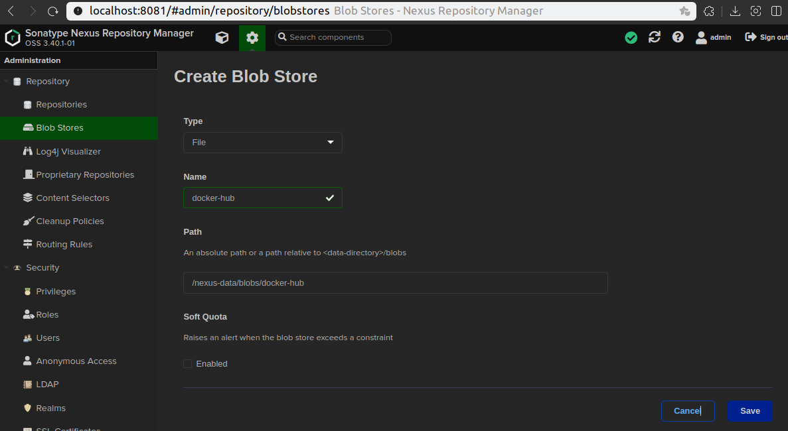
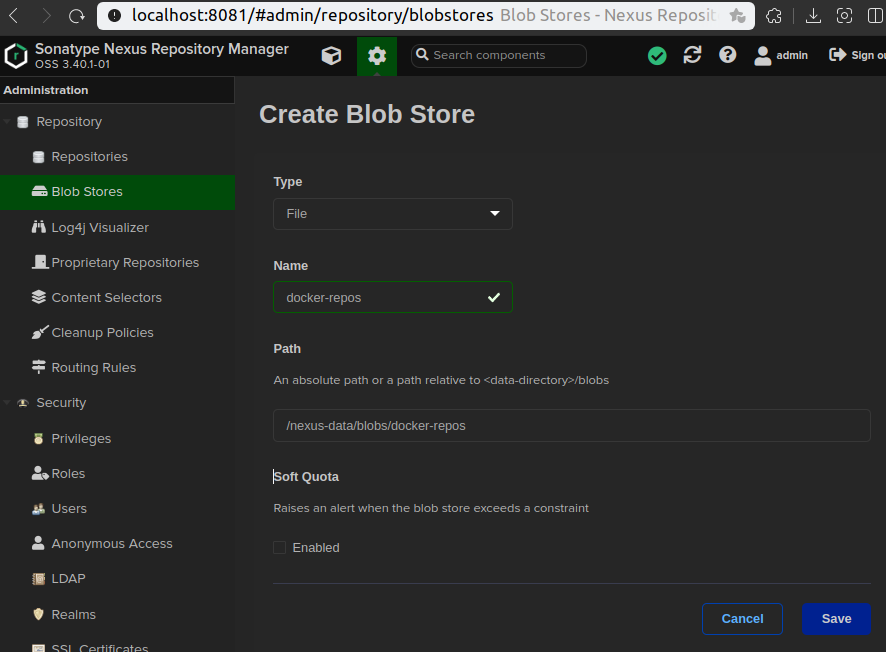
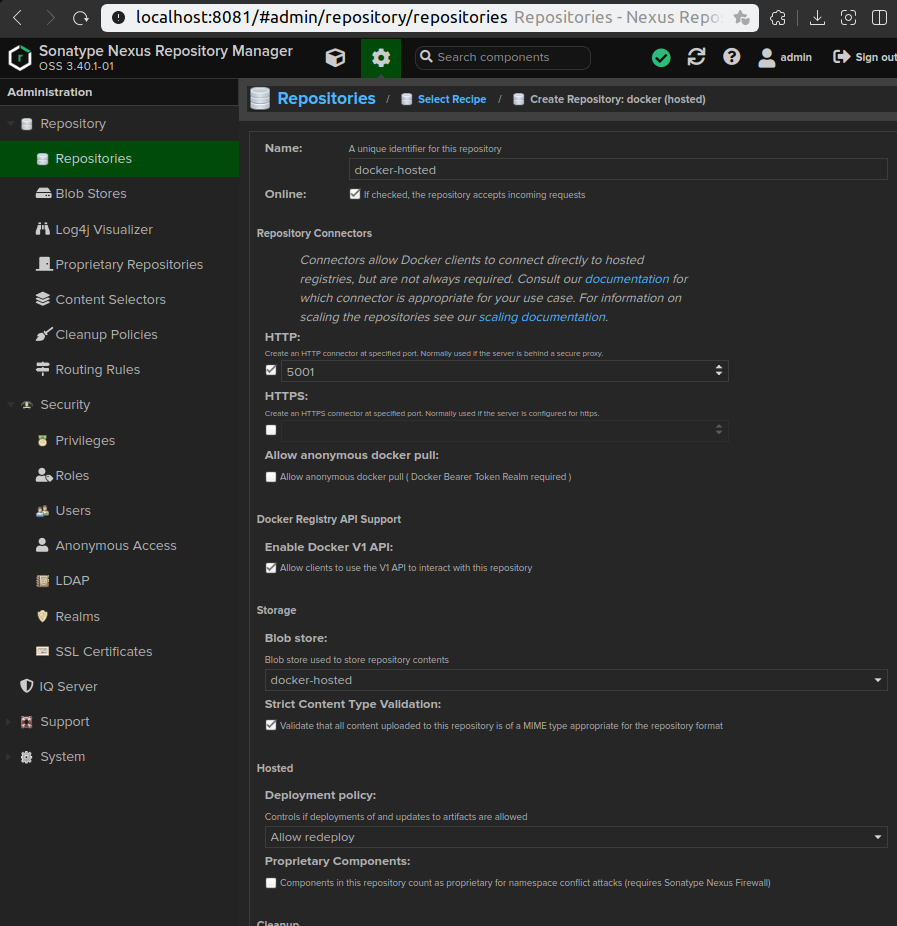
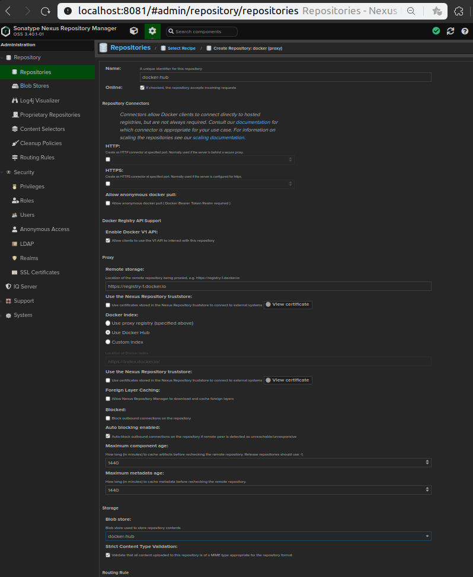
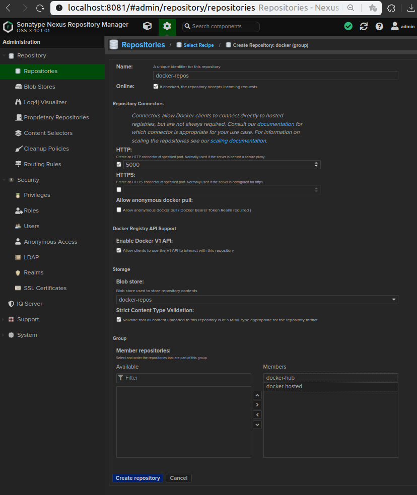
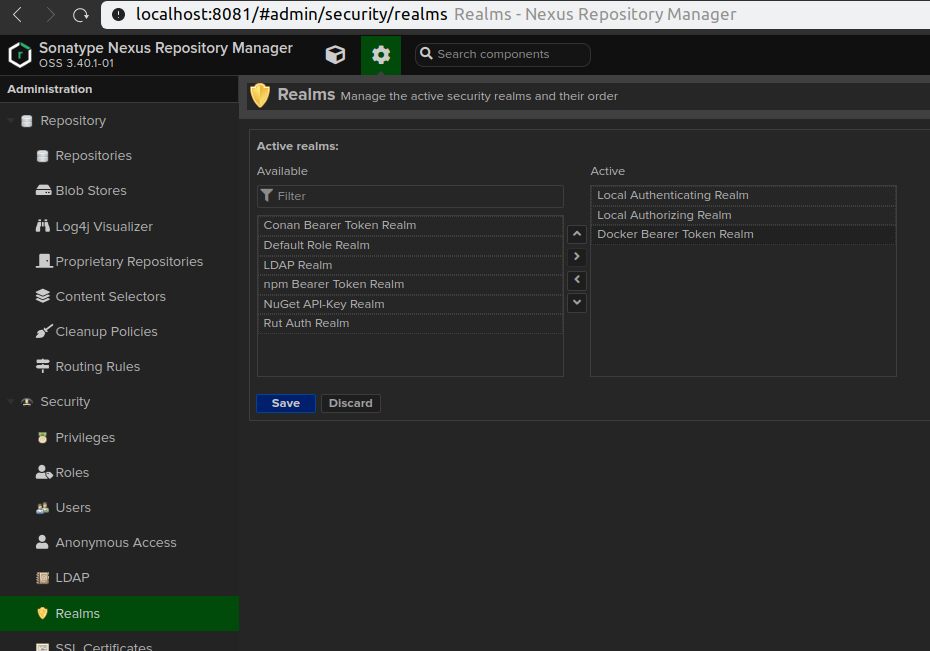

# Nexus maven repository

## 1. Nexus 설치 by Docker

```bash
mkdir nexus-data

docker run --name nexus -d -p 5000:5000 -p 8081:8081 -v `pwd`/nexus-data:/nexus-data -u root sonatype/nexus3
```

## 2. Nexus 로그인

- admin 계정 비번 찾기

```bash
-- 도커 내부 파일 확인
docker exec -it nexus cat /nexus-data/admin.password
-- 아니면 로컬에 마운트된 폴더에서 확인
cat `pwd`/nexus-data/admin.password
```

- Nexus 웹 접속 및 로그인

```
http://localhost:8081

ID: admin
PW: `docker exec -it nexus cat /nexus-data/admin.password`
```

## 3. build.gradle 설정

### [Publishing Overview](https://docs.gradle.org/current/userguide/publishing_setup.html#publishing_overview)

#### UploadArchives (Legacy publishing)

```bash
./gradlew uploadArchives  
```

> [Official doc](https://docs.gradle.org/5.6.4/userguide/artifact_management.html#artifact_management)  
> [Kwonnam reference](https://kwonnam.pe.kr/wiki/gradle/maven)
> 
> The uploadArchives task was used in combination with the legacy Ivy or Maven publishing mechanisms. It has been removed in Gradle 7. You should migrate to the maven-publish or ivy-publish plugin instead.  
> Please refer to the documentation of the Maven Publish plugin for publishing on Maven repositories. Please refer to the documentation of the Ivy Publish plugin for publishing on Ivy repositories.

#### Publish

```bash
./gradlew publish
```

> [Official doc](https://docs.gradle.org/current/userguide/publishing_maven.html#publishing_maven)

---

# Nexus docker registry

- hosted: local에 이미지를 push하면 저장해두는 registry
- proxy: 외부 docker hub에 이미지를 내려받아 저장하고 local로 내려준다
- group: hosted와 proxy를 묶어 하나의 registry로 운영하도록 도와준다.

> group registry를 통해 pull과 push 모두 하면 편하지만  
> 아래와 같이 group registry로 push하니 프로 라이센스가 필요하다고 한다  
> 
> denied: Deploying to groups is a PRO-licensed feature.

## 1. Blob 설정

- docker hosted blob


- docker proxy blob



- docker group blob
  



## 2. Repository 설정

- docker hosted repository



- docker proxy repository



- docker group repository



## 3. Realms 설정

- realms: nexus 인증 관련설정 Docker 권한을 추가한다.



## 4. 기타 설정

- http 프로토콜 사용시 로컬 도커에 insecure-registries 설정을 해준다.

```bash
sudo vim /etc/docker/daemon.json

> {"insecure-registries": ["localhost:5000"]}

docker info

> Insecure Registries:
>  localhost:5000

service docker restart
docker restart nexus
```

## 5. 테스트

- 커맨드라인 Pull & Push

```bash
docker login -u admin -p password localhost:5000

-- 원격 docker hub에서 hello-world:latest 이미지를 proxy registry에 저장한뒤 local로 내려준다.
docker pull localhost:5000/hello-world

-- 로컬의 이미지를 hosted registry로 push하여 저장한다.
docker tag localhost:5000/hello-world localhost:5000/test-image
docker push localhost:5000/test-image
```

- Jib 라이브러리를 통한 image Push

```bash
./gradlew :api:jib -DsendCredentialsOverHttp=true
-- http 프로토콜 사용시 sendCredentialsOverHttp 옵션 넣어줄것
```
